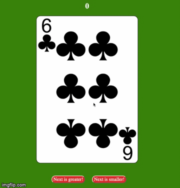

# FlipDatCard ~ The Game

This project is a card game written in TypeScript and React framework. The rules are simple user has to make a guess wherever the next card is greater or lower than the next one. 
Rules:
* The whole deck consists of 52 card. Red Diamonds, Clubs as well as black Heart and Spades. 
* Aces have the lowest value equal to 1. 
* Jacks, Queens and Kings have a value of 11.
* You can play it in your browser [here](https://szymonrucinski.github.io/flipdatcard/)!

<p>
<p align="center">

</p>
</p>

## Getting Started

Simply download this repository and build it using TS compliter.
Game has been created as project for component programming by Szymon Ruciński an Information Technology student.
This is my first React + TS web application.


### Installing

Simply copy these commands in order to clone repository.

```
$ git clone https://github.com/szymonrucinski/flipdatcard.git
```
Run the following command to compile project files and open Web App on port 8080 in your browser
```
$ npm start
```


## Deployment

You can also build project files using:

```
$ npm run buildw
```

## Built With

* WebPack
* Mobx
* React
* TypeScript

## Authors

* **Szymon Ruciński** - *Whole work* - [Szymon Ruciński](https://github.com/szymonrucinski)
* [My website](https://szymonrucinski.pl)


## License

This project is licensed under the MIT License - see the [LICENSE.md](LICENSE.md) file for details.
I publish it for other students and people who want to learn TypeScript and React.


